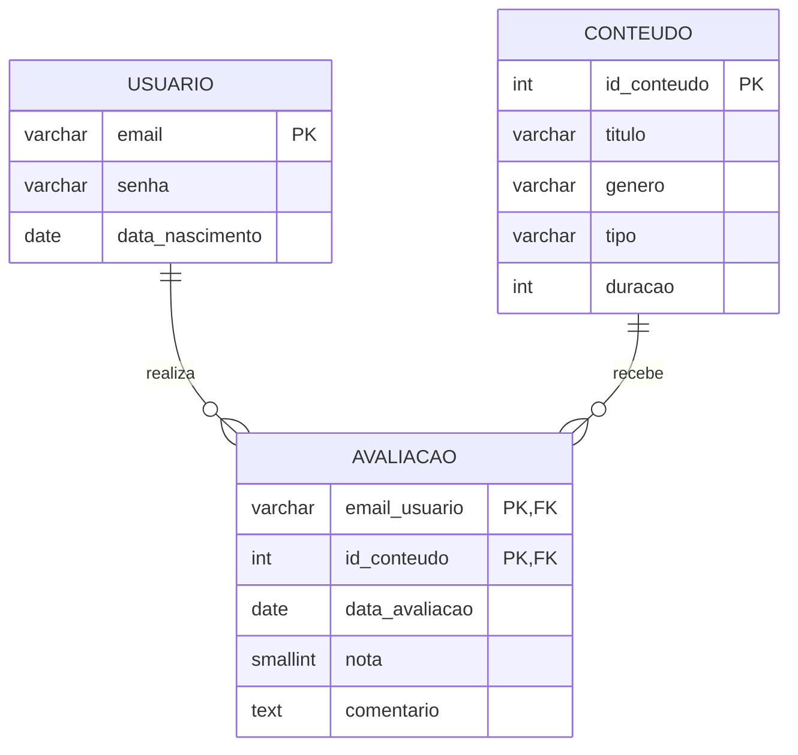

# Sprint 2 — Modelo Lógico, SQL e Normalização

**Projeto:** Radar de Dados — streaming de filmes e séries
**SGBD:** PostgreSQL 14+
**Sprint anterior (modelo conceitual):** [sprint1-radar-de-dados](https://github.com/LucasBorgesKrz/sprint1-radar-de-dados)
**Equipe:** Lucas Borges Krziminski

Este repositório transforma o modelo conceitual (MER) da Sprint 1 em um modelo lógico relacional, verifica as formas normais até a **3FN** e implementa o banco em SQL (DDL + DML).

## Estrutura do repositório

```
.
├── README.md          # diagrama lógico + justificativa da 3FN
└── sql/
    ├── 01_ddl.sql     # CREATE TABLE (PK, FK, NOT NULL, UNIQUE, CHECK, DEFAULT)
    └── 02_dml.sql     # INSERTs + consultas SELECT com JOIN
```

## 1. Do modelo conceitual ao lógico

O cenário da Sprint 1 é uma plataforma de streaming em que cada usuário pode avaliar vários filmes e séries, dando uma nota e um comentário. O MER tinha três entidades e uma relação **N:N** (Usuário avalia Conteúdo). A conversão para o lógico seguiu estas regras:

| Conceitual (Sprint 1) | Lógico (Sprint 2) |
|---|---|
| Entidade **Usuario** (`email` PK, `senha`, `data_nascimento`) | Tabela `usuario`, mantendo `email` como PK |
| Entidade **Conteudo** (`id_conteudo` PK, `titulo`, `genero`, `tipo`, `duracao`) | Tabela `conteudo`, mantendo `id_conteudo` como PK |
| Entidade **Avaliacao** + relação N:N | Tabela `avaliacao`, com FKs `email_usuario` e `id_conteudo`, que juntas formam a **PK composta** |

Nenhuma entidade ou atributo foi adicionado ou removido em relação ao MER da Sprint 1.

## 2. Diagrama do Modelo Lógico



## 3. Justificativa da 3FN

Para mostrar o que a normalização resolve, partimos de uma tabela "bruta" única, como se os dados estivessem numa planilha:

```
AVALIACOES_BRUTO(
  email, senha, data_nascimento,
  { id_conteudo, titulo, genero, tipo, duracao,
    data_avaliacao, nota, comentario }        <- grupo repetitivo
)
```

### Passo 1 — Primeira Forma Normal (1FN)

**Problema:** o bloco entre chaves é um **grupo repetitivo**. Um mesmo usuário aparece com várias avaliações dentro de uma única linha, então os atributos não são atômicos.

**Correção:** cada avaliação passa a ocupar **uma linha própria**, com um único valor por campo. A chave passa a ser composta: `(email, id_conteudo)`.

```
AVALIACAO_1FN(
  email, id_conteudo,                    <- PK composta
  senha, data_nascimento,
  titulo, genero, tipo, duracao,
  data_avaliacao, nota, comentario
)
```

### Passo 2 — Segunda Forma Normal (2FN)

**Problema:** a 2FN exige que todo atributo não-chave dependa da chave **inteira**. Com PK composta, existem **dependências parciais**:

| Dependência | Atributos | Tipo |
|---|---|---|
| `email` → | `senha`, `data_nascimento` | **parcial** (depende só de parte da PK) |
| `id_conteudo` → | `titulo`, `genero`, `tipo`, `duracao` | **parcial** (depende só de parte da PK) |
| `(email, id_conteudo)` → | `data_avaliacao`, `nota`, `comentario` | total (correta) |

**Anomalias que isso causava:**
- *Atualização:* trocar a senha de um usuário obrigava a alterar todas as linhas das avaliações dele.
- *Inserção:* não dava para cadastrar um conteúdo novo sem que alguém o avaliasse, nem um usuário que ainda não avaliou nada.
- *Exclusão:* apagar a última avaliação de um conteúdo apagava o próprio conteúdo.

**Correção:** cada grupo de dependência vira sua própria tabela.

```
USUARIO(email PK, senha, data_nascimento)
CONTEUDO(id_conteudo PK, titulo, genero, tipo, duracao)
AVALIACAO(email_usuario PK/FK, id_conteudo PK/FK, data_avaliacao, nota, comentario)
```

### Passo 3 — Terceira Forma Normal (3FN)

A 3FN proíbe **dependência transitiva**: um atributo não-chave que depende de outro atributo não-chave (`chave → A → B`, com A e B não-chave). Verificamos cada tabela resultante do passo 2:

| Tabela | Dependências existentes | Há dependência transitiva? |
|---|---|---|
| `usuario` | `email` → `senha`, `data_nascimento` | **Não.** `senha` e `data_nascimento` não determinam um ao outro. |
| `conteudo` | `id_conteudo` → `titulo`, `genero`, `tipo`, `duracao` | **Não.** Nenhum atributo não-chave determina outro: `genero` não determina nada além de si mesmo, e `tipo` não determina `duracao` (dois filmes têm durações diferentes). |
| `avaliacao` | `(email_usuario, id_conteudo)` → `data_avaliacao`, `nota`, `comentario` | **Não.** Os três dependem só da chave completa e são independentes entre si. |

**Conclusão:** após eliminar as dependências parciais na 2FN, o modelo **já satisfaz a 3FN**. Não havia dependência transitiva a ser eliminada, porque o MER da Sprint 1 já separou bem as entidades. Nesta etapa, o trabalho foi comprovar isso tabela por tabela.

> **Evolução possível (fora do escopo desta sprint):** `genero` hoje é texto livre em `conteudo`, o que permite variações de digitação ("Crime" vs "crime"). Se o projeto crescer, vale criar uma tabela `genero (id_genero PK, nome)` e transformar `conteudo.genero` em FK. Isso melhora a consistência dos dados, mas não é exigido pela 3FN, já que nenhum outro atributo depende de `genero`.

## 4. Restrições de integridade

| Tabela | Restrições |
|---|---|
| `usuario` | PK `email`; `senha` e `data_nascimento` NOT NULL; CHECK de formato em `email`; CHECK em `data_nascimento` |
| `conteudo` | PK `id_conteudo` (gerada automaticamente); `titulo`, `genero`, `tipo`, `duracao` NOT NULL; UNIQUE `(titulo, tipo)`; CHECK `tipo` IN (`FILME`, `SERIE`); CHECK `duracao > 0` |
| `avaliacao` | PK composta `(email_usuario, id_conteudo)`; CHECK `nota` entre 1 e 5; `data_avaliacao` DEFAULT `CURRENT_DATE`; FKs para `usuario` e `conteudo` com `ON DELETE CASCADE` e `ON UPDATE CASCADE` |

**Decisões de projeto:**
- A PK composta em `avaliacao` garante que um usuário avalia cada conteúdo **uma única vez**.
- A escala da `nota` (1 a 5) e a unidade de `duracao` (minutos; para séries, a duração média do episódio) foram definidas nesta sprint, pois o MER não especificava.
- A coluna `senha` deve armazenar o **hash** da senha, nunca o texto puro. Os valores do `02_dml.sql` são hashes fictícios.

## 5. Como executar

```bash
createdb radar_de_dados
psql -d radar_de_dados -f sql/01_ddl.sql
psql -d radar_de_dados -f sql/02_dml.sql
```

O `02_dml.sql` contém 4 usuários, 5 conteúdos e 8 avaliações (mínimo de 3 `INSERT` por tabela), além de 3 consultas com `JOIN`:

1. **INNER JOIN de 3 tabelas:** quem avaliou o quê, com gênero, nota e data.
2. **JOIN + GROUP BY:** nota média e total de avaliações por conteúdo.
3. **LEFT JOIN:** conteúdos que ainda não foram avaliados.
